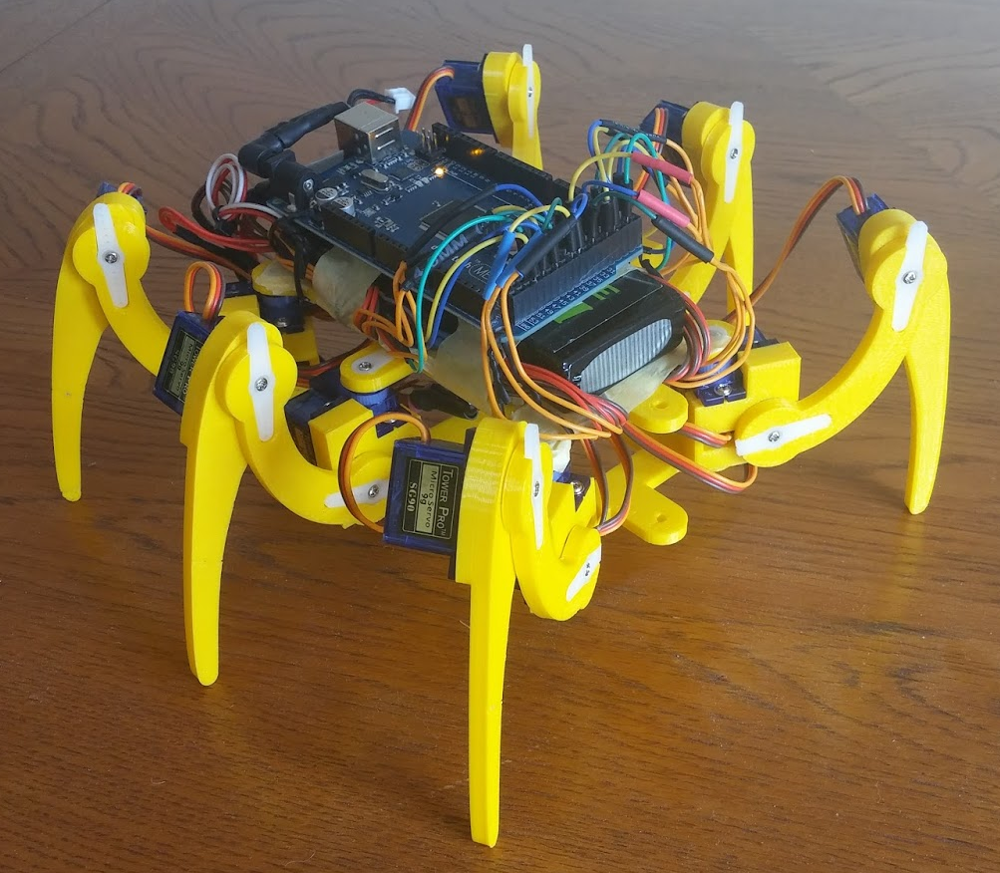

# Hexalib
Arduino library for controlling my homebrewed hexapod

## Project
This hexapod was created as a research project in my second year of uni at Monash. It has a 3D printed chassis, an Arduino Mega 2560 as the controller board, and is powered by an onboard LiPo battery.

For more about the hexapod, you can visit my **[blog/research log](http://0xapod.blogspot.com.au/)** for the project.

## Note
The code in this repository was more or less a prototype (though it definitely did work). It's fairly inflexible (see `Hexapod::Hexapod` for a bunch of numbers that I "calculated" based on my specific hexapod and hardcoded into the library). In truth, the whole library is built for my exact hexapod, and for any other hexapod that isn't *exactly* the same, it probably won't be very useful. As such, I wouldn't recommend trying to use my code directly. Instead, I'd suggest copying the design of my code (which I think is fine), not the code itself.
